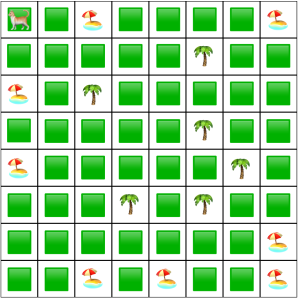

# Cat on an Island?!

In this project, Mihai Tanase and I created our own survival game in which an agent, a cat, needs to survive as long as possible in the environment, an island. Specifically, the environment is an 8 by 8 state matrix and the states are one of three types: beach, grass, or forest. The beach and forest states contain limited resources which the cat might obtain by performing risky state-specific actions: fish and hunt, respectively. Successfully obtaining resources replenishes some of the cat's health, which decreases with each time step. The environment can be seen in the figure.

  

In this difficult environment, we compared the performance of two reinforcement learning algorithms: Q-learning and SARSA. Both algorithms had five exploration methods: greedy, ε-greedy, optimistic initial values, upper-confidence-bound, and Boltzmann exploration. The results showed that the algorithms performed significantly better than random. These findings highlight the importance of choosing the appropriate learning algorithm and exploration strategy for a given problem.

This project was done as a part of the Reinforcement Learning Practical at the University of Groningen and was graded a 9 by Prof. Matthia Sabatelli.
